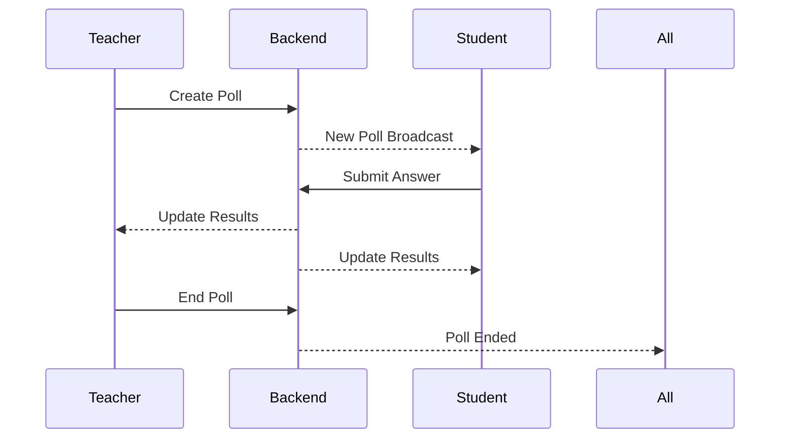
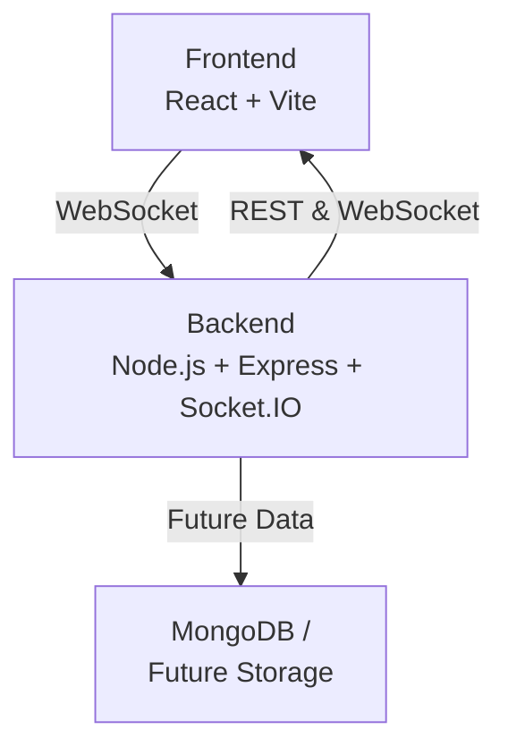

# 🟣 Intervue Polling

Live, real-time interactive polling platform for classrooms, interviews, and workshops.

 **Frontend**: [Intervue Polling on Vercel](https://polling-app-frontend-delta.vercel.app/)
 **Backend**: [Polling API on Render](https://polling-rr4j.onrender.com/)

---

## ✨ Overview

**Intervue Polling** lets teachers and students connect seamlessly:

* Teachers can create live polls and monitor responses.
* Students join, submit answers, and see live results.
* Everyone can chat in real-time.

---

## 🛠️ Features

✅ **Role Selection**
Choose whether you are a teacher or a student.

✅ **Teacher Dashboard**

* Create polls with multiple options.
* Set poll duration.
* Mark correct answers.
* See live results.
* Kick out participants.
* View poll history.

✅ **Student Dashboard**

* Join with your name.
* Wait for the teacher to start.
* Answer live polls.
* See results instantly.

✅ **Real-time Chat**

* Teacher ↔ Student messaging.
* All messages broadcast to everyone.

✅ **Responsive Design**

* Works across desktop, tablet, and mobile.

---

## ⚙️ How It Works

Here’s a simple flow of interactions:



---

## 🏛️ Architecture



**Frontend:**

* React + Tailwind CSS
* Deployed on Vercel

**Backend:**

* Express server with Socket.IO
* Deployed on Render

---

##  Main Functionalities

🔹 **Polling**

* Create and end polls live
* Monitor who answered

🔹 **Answer Tracking**

* Show counts and percentages in real-time

🔹 **Kick-out**

* Remove disruptive participants

🔹 **Chat**

* Bi-directional messaging across all users

---


##  Challenges Faced

-  Handling **real-time updates** over Socket.IO without race conditions.
-  Making sure results persisted when students or teachers reconnected.
-  Smooth UX when polls ended automatically or when all students answered.
-  Deploying CORS-safe backend and frontend separately.
-  Managing state transitions between **waiting**, **answering**, and **results view**.

---

##  Getting Started Locally

```bash
# Clone Frontend
git clone https://github.com/Rohit-554/PollingApp_Frontend.git
cd polling-frontend
npm install
npm run dev
```


 Update the frontend `socket` URL in `socket.js` to your local backend or Render backend.

---

##  Live Demo

🔗 **Frontend:** [Intervue Polling](https://polling-app-frontend-delta.vercel.app/)
🔗 **Backend:** [API](https://polling-rr4j.onrender.com/)

---

##  Author

Built with ❤️ by Rohit

